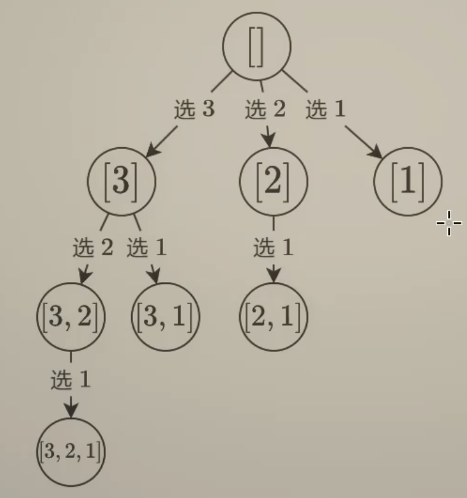
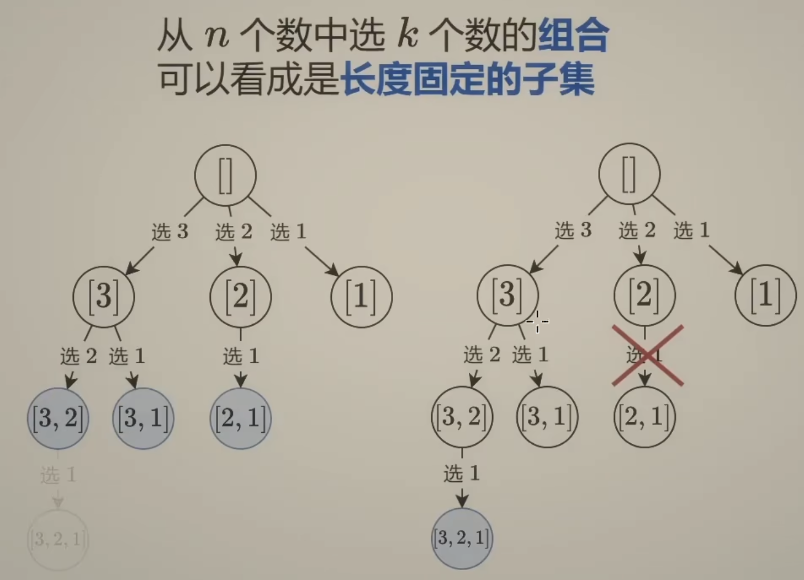
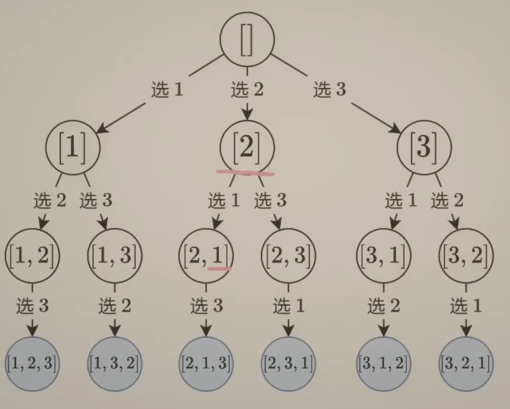
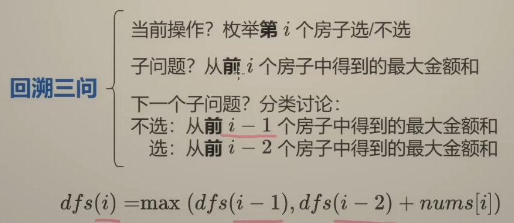

# leetcode_hot100
刷题刷题


## 回溯与动态规划
- 回溯 
  - 像走迷宫，遇到死路就退回岔路口换方向。通过试错探索所有可能路径，常用于穷举问题（如八皇后）。
  - 代码实现通常是递归+撤销操作（比如棋盘上落子后撤回）。
  - 回溯，通常是在「递」的过程中增量地构建答案，并在失败时能够回退。
  - 回溯法的时间复杂度通常是指数级（O(2^n)或O(n!)），适合解空间较小的问题。
  - DP 的时间复杂度通常是多项式级（O(n²)或O(n³)），适合解空间大但子问题重叠的问题。

- 动态规划
  - 通过将问题分解为子问题并存储子问题的解来优化递归。
  - 像背单词时先背简单词再记复杂词。
  - 将问题分解为相互关联的子问题，并存储子问题的解避免重复计算。
  - 比如斐波那契数列，算f(5)需要f(4)和f(3)，而f(4)又需要f(3)和f(2)，此时存下中间结果能大幅减少计算量。
  - 动态规划常被看作“递归+记忆化”，
  - 与回溯的区别在于动态规划有重叠子问题和最优子结构
- 使用res保持结果 or 直接return 场景区别
  - 需要所有解 → 回溯法 + res。
  - 只需存在性/单一解 → DFS直接返回。
  - 子问题重叠 → DP + 返回当前节点代表的值 + 记忆化。

| 概念          | 核心思想       | 是否具有状态回退 | 是否记录历史最优解 | 常用于      |
| ----------- | ---------- | -------- | --------- | -------- |
| 递归          | 函数调用自身     | 不一定      | 不一定       | 分治、树形问题  |
| DFS（深度优先搜索） | 一条路走到底     | 通常有      | 不一定       | 图、树遍历    |
| 回溯          | DFS + 状态回退 | 是        | 不一定       | 排列组合、子集  |
| 动态规划        | 记录子问题最优解   | 否        | 是         | 最优化问题、计数 |

- 递归是技术手段（函数自己调自己）
- DFS是遍历策略（走到不能再走）
- 回溯是DFS的变种，带“撤销”（递归+DFS+回退）
- DP是优化策略，避免重复计算

什么时候用哪种写法？

1. **能通过子树返回值自然组合出答案 → 用返回值递归**

   * 例子：二叉树最大深度、二叉树节点数、二叉树是否平衡（取子树高度后组合）。
   * 特点：函数结果就是子树问题的解。
   * 另一方面，这种问题一般写法很简单，这是因为程序内部帮你维护了一个递归栈，不需要手动实现入出栈的逻辑，所以代码量少

2. **答案依赖“遍历过程中的路径信息”或“全局最佳值” → 用DFS + 外部变量/参数**

   * 例子：最长路径（直径）、最大路径和、路径和问题、统计满足条件的路径数。
   * 特点：答案不能只靠子树独立结果，需要在遍历时累积/更新，维护全局状态。

一句话总结：

* **返回值递归**适合“分而治之”，子问题的解能合并成父问题的解。
* **参数递归 + 全局变量**适合“路径式 DFS”，答案必须在遍历过程中不断记录和更新。

---

## 到底是return dfs(n-1) 还是 return ans
1. **检查递归函数的定义**：
   - 如果 `dfs` 的返回值直接就是问题的答案（如 LCS 的长度、树的高度），则直接 `return dfs(全局参数)`。
   - 如果 `dfs` 的返回值是子问题的局部信息（如子树深度），而答案需要从这些局部信息中进一步计算或比较（如直径），则需要 `ans`。

2. **是否需要全局信息**：
   - 如果答案是递归函数在特定参数下的直接结果，无需跨分支比较或累积，则直接返回 `dfs`。
   - 如果答案需要在递归的多个分支中寻找最优解（如最大值、最小值），则需要维护 `ans`。
3. 如果使用的是直接return `dfs`，则肯定不需要全局的ans了；如果
## 动态规划中，DP数组的初始化长度是n还是n+1？
- 在DFS写法中，边界条件如果是小于0，比如：if i<0 ...，则选择初始化长度为n+1；或者需要避免复数下标时，则选择初始化长度为n+1（或n+2，比如198.打家劫舍）
- 反之，如果边界条件是等于0，比如：if i==0 ...，则选择初始化长度为n
                          
## dfs正序还好是逆序？
- 正序DFS：用于组合、排列问题，通过 start 限制选择范围，避免重复组合。（例题：39. 组合总和、78. 子集）
- 逆序DFS：常用于依赖后续状态的DP问题，通常结合交换、排序或标记去重。。
- 核心原则：根据问题的唯一性要求选择顺序，确保不重复计算或遗漏解。

## **子集型回溯**、**组合型回溯**和**排列型回溯**区别
| **类型**       | **解的结构**          | **选择方式**           | **终止条件**           | **典型例题**               |
|----------------|-----------------------|------------------------|------------------------|----------------------------|
| **子集型回溯** | 所有子集（幂集）      | 选或不选，跳过已选区间  | 遍历完所有元素         | 78. 子集，90. 子集 II      |
| **组合型回溯** | 固定长度的子集        | 选或不选，跳过已选区间  | 路径长度等于 `k`       | 77. 组合，40. 组合总和 II  |
| **排列型回溯** | 所有顺序不同的序列    | 全量选择，跳过已选元素  | 路径长度等于原集合长度 | 46. 全排列，47. 全排列 II  |
---
其中，典型例题I无重复元素,II都是带重复元素。

从二叉树的角度来看，子集型回溯、组合型回溯和排列型回溯的区别如下：
- 子集型回溯：



- 组合型回溯（可剪枝）：




- 排列型回溯：



---
回溯三问：（注意“第”和“前”）

> 在上图中，当前操作：表示分为`选`和`不选` 
> 
> 子问题：表示dfs(i)
> 
> 下一个子问题：表示在选和不选的情况下，如何继续递归
---

 **如何区分问题类型？**
1. **是否需要考虑顺序**：
   - 是 → **排列型回溯**（如全排列）。
   - 否 → **子集或组合型回溯**。
2. **是否需要固定长度**：
   - 是 → **组合型回溯**（如组合问题）。
   - 否 → **子集型回溯**（如子集问题）。

---

 **通用优化技巧**
1. **剪枝**：在循环中提前终止无效分支（如剩余元素不足时跳过）。相比于子集型回溯，组合型回溯一般可以应用剪枝。
2. **去重**：排序后跳过相同元素（`nums[i] == nums[i-1]`）。
3. **记忆化**：对于重复子问题（如组合总和），可用缓存优化。

## 为什么最长公共子序列（LCS）直接返回 dfs(m-1, n-1)，而在 最长递增子序列（LIS） 问题中需要遍历所有 dfs(i) 并取最大值
- LCS的dfs(i, j) 表示：text1的`前`i+1个字符 和 text2的前j+1个字符 的最长公共子序列（LCS）长度。
- LIS的dfs(i) 表示：以 nums[i] 为`结尾` 的最长递增子序列（LIS）的长度。每个 dfs(i) 是独立的子问题，其结果仅与前面的元素相关，但无法直接推导出全局最优解，必须通过比较所有可能的子问题结果。
- LCS的 `dfs(i,j)` 是全局视角：直接对应两个字符串的完整前缀。
- LIS的 `dfs(i)` 是局部视角：仅关注以某个元素结尾的子序列。

# 动态规划
```
线性DP： 
dp[i] → dp[i+1] → dp[i+2] （单线推进）

状态机DP：
        [状态A]
        ↗     ↖
[状态B] ←     → [状态C]
        ↖     ↗
        [状态D]
```
如何判断该用哪种DP？
问自己两个问题：

- 是否需要区分多个状态？
    - 如果问题只需要关注「做到第i步时的最优解」（如最大和、最长序列），用线性DP。
    - 如果需要区分「第i步处于不同状态时的解」（如是否持有股票、是否犯罪），用状态机DP。
- 是否有明确的状态转移规则？
    - 例如股票问题中「持有→卖出→冷冻期」的规则就是典型的状态机。


